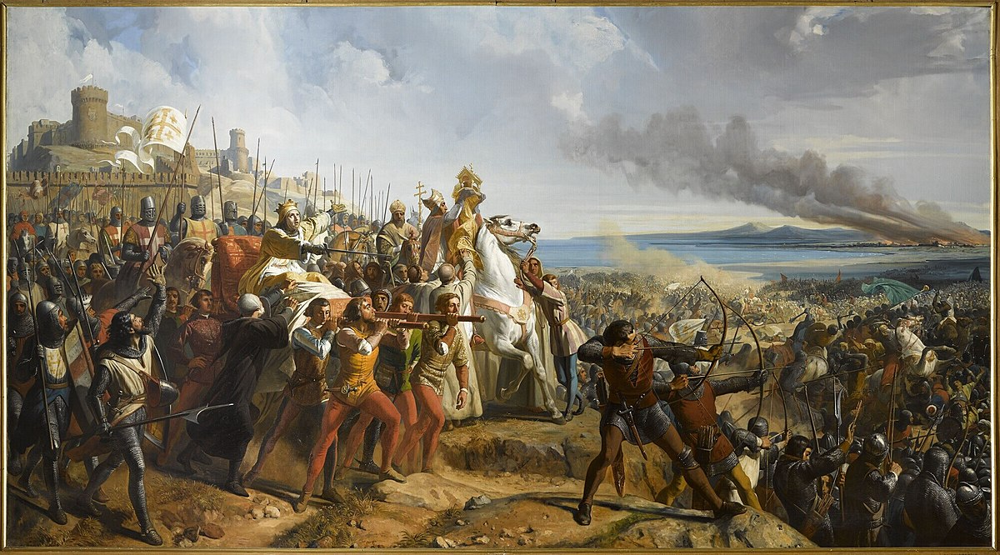

# Chess Crusader 
The game Chess Crusader is a strategic board game designed similarly to classic chess, but with different movement
patterns and abilities for the pieces.<br>
The game features two sets of pieces, Christians **(White Side)** and Muslims **(Black Side)**, which differ only in name and appearance, but have identical abilities and movements. <br>
The game is two-player and network-based, where each player runs their own program and plays in their own dedicated application. 
Initially, the first player runs the program, and once the second player starts their program, the game begins.<br>
All of a player's moves are sent to the opponent's app and displayed there. The game includes a graphical user interface, utilizes object-oriented programming, and all data is transmitted solely through sockets.


## Table of Contents

- [Gameplay Overview](#gameplay-overview)
  - [General Rules and Board Setup](#general-rules-and-board-setup)
  - [Starting the Game](#starting-the-game)
  - [Objective of the Game](#objective-of-the-game)
  
- [Player Interactions](#player-interactions)
  - [Selecting a Piece](#selecting-a-piece)
  - [Moving a Piece](#moving-a-piece)
  - [Attacking an Opponent's Piece](#attacking-an-opponents-piece)
  - [End of Turn](#end-of-turn)
  - [Notes](#notes)
- [Game Pieces](#game-pieces)
  - [Castle](#castle--movement-1--power-1)
  - [Knight / Arab Cavalry](#knight--arab-cavalry--movement-2--power-1)
  - [Soldier](#soldier--movement-1--power-1)
  - [Archer](#archer--movement-1--power-2-no-special-ability)
  - [Catapult / Assassin](#catapult--assassin--movement-1--power-0)
- [Installation](#installation)
- [Running the Game](#running-the-game)
- [Project Structure](#project-structure)
- [License](#license)
- [Contact](#contact)


## Gameplay Overview

### General Rules and Board Setup
The game board consists of an 8x8 grid. Each square on the board can be either white or black, and the pieces move
within these squares. Each player controls a set of pieces, either the Christians or the Muslims. Each set consists of 8
pieces, which are symmetrically arranged on opposite sides of the board.

### Starting the Game

The white player (Christians) always starts the game. Players take turns moving one piece at a time.

### Objective of the Game

The main objective of the game is to capture the opponent's castle. In this game, there is no concept of checkmate;
instead, the opponent's castle must be captured by one of the player's pieces.

## Player Interactions

### Selecting a Piece
- The player can select a piece by clicking on it. Once selected, the possible squares for that piece's movement will
be highlighted.

### Moving a Piece

- The player moves a piece by clicking on the destination square.

- Pieces can move one or two squares in any direction (vertically, horizontally, or diagonally) depending on their type and allowed movement range, except for the pawn, which can only move towards the opponent's side of the board (as shown in the picture below).

  

- Pieces cannot overlap with each other or move off the board.

- Pieces cannot be moved beyond their allowed movement range.

- All pieces can jump over other pieces.

### Attacking an Opponent's Piece:

- If a piece moves to a square occupied by an opponent's piece, the opponent's piece is captured and removed from the board.

- Pieces cannot attack an opponent's piece that has a higher power than themselves.

### End of Turn:

- After each move, the board is updated for both players.

- The turn is passed to the opponent, and the next move is made by the opponent.

### Notes:
- A player who is not currently taking their turn cannot move their pieces.

- Frame title indicates whose turn it is and which side you are.

- Pieces can move a maximum distance according to their allowed movement in any direction (vertically,horizontally, or diagonally), except for the soldier piece, which can only move towards the opponent's side of the board.

## Game Pieces

### The behavior of the pieces is different from chess:
- #### Castle — <i>Movement: 1 / Power: 1</i>

  The power of all allied pieces adjacent to the castle (any piece in one of the 9 squares around the castle, excluding enemy pieces) is increased by one. The castle cannot attack an opponent's piece (i.e., it cannot move to a square occupied by an enemy piece).<br>
  White and Black **Castle** in order :

   

- ####  Knight / Arab Cavalry — <i>Movement: 2 / Power: 1</i>

  Can move one or two squares per turn.<br>
  White and **Black Knight / Arab Cavalry** in order :

   

- #### Soldier — <i>Movement: 1 / Power: 1</i>
  The power of all allied soldiers adjacent to a soldier (any soldier in one of the 9 squares around a soldier,
  excluding enemy soldiers) is increased by one. For example, at the beginning of the game, the two central soldiers
  will have a power of 3 (due to the two adjacent soldiers), and the corner soldiers will have a power of 2 (due to
  only one adjacent soldier). The soldier's movement is limited to the three squares directly in front of it (towards the
  opponent).<br>
  White and Black **Soldier** in order :

   

- #### Archer — <i>Movement: 1 / Power: 2 (No Special Ability)</i><br>
  White and Black **Archer** in order :

   

- #### Catapult / Assassin — <i>Movement: 1 / Power: 0</i>
  The power of all enemy pieces adjacent to the catapult/assassin (any enemy piece in one of the 9 squares around
  the catapult/assassin, excluding allied pieces) is reduced by two.<br>
  White and Black **Catapult / Assassin** in order :

   

**Note**: The positive or negative impact on the power of pieces is temporary and only applies during each turn.

## Installation
To run this game locally:

1. Ensure you have [Java Development Kit (JDK)](https://www.oracle.com/java/technologies/javase-jdk11-downloads.html) installed.
2. Clone this repository:
   ```bash
   git clone https://github.com/yourusername/ChessCrusader.git
   ```
3. Navigate to the project directory:
   ```bash
   cd ChessCrusader
   ```
4. Compile the Java files:
   ```bash
   javac -d bin src/main/java/MohammadHosseinKv/**/*.java
   ```
5. Run the game:
   ```bash
   java -cp bin MohammadHosseinKv.Main
   ```

or from step 3:

3. Open the project in your preferred IDE.

4. Run the Main.java file to start the game.

## Running the Game

1. **Starting the Game**:

   - Player 1 starts by running the game application and clicking on create game button.

   - Player 2 then runs the game and clicks on join game button and the game begins.

2. **Network Play**:

   - The game supports network play. Ensure both players are connected to the same network or in this program localhost which makes playing the game possible without any server by running 2 instance of program.

## Project Structure
The project is organized as follows:
```
ChessCrusader/
│
├── src/
│   ├── main/
│   |   └── java/
│   |       └── MohammadHosseinKv/
│   |           ├── controller/
│   |           │   └── GameController.java
│   |           ├── gui/
│   |           │   ├── GameFrame.java
│   |           │   └── StartFrame.java
│   |           ├── logic/
│   |           │   ├── canAdjustAdjacentPiecesPower.java
│   |           │   ├── GameBoard.java
│   |           │   └── Game.java
│   |           ├── model/
│   |           │   ├── Archer.java
│   |           │   ├── Assassin.java
│   |           │   ├── Castle.java
│   |           │   ├── Knight.java
│   |           │   ├── Piece.java
│   |           │   ├── Side.java
│   |           │   └── Soldier.java
│   |           ├── network/
│   |           │   ├── Command.java
│   |           │   └── SocketManager.java
│   |           ├── util/
│   |           │   ├── Constants.java
│   |           │   └── Util.java
│   |           └── Main.java
|   └── assets/
│       └── (all game static images)
│
├── AP14022-FinalProject.pdf
│
├── LICENSE
|
└── README.md
```
### src/main/java/MohammadHosseinKv/

This is the root package for all the Java source code.

#### controller/

- **GameController.java**: Controls the game using Game **(logic)** and GameFrame **(GUI)** classes.

#### gui/

- **GameFrame.java & StartFrame.java**: These classes handle the graphical user interface (GUI) of the game.
`StartFrame` sets up the initial game window, while `GameFrame` manages the main game screen.

#### logic/

- **GameBoard.java**: Represents the game board and manages the placement and movement of pieces on the board.

- **canAdjustAdjacentPiecesPower.java**: Represents an interface for pieces that can adjust their adjacent pieces power.

- **Game.java**: Represents the game logic that implements `GameBoard` interface and manages logic needed to move pieces, etc.

#### model/

- **Piece.java**: The abstract base class for all game pieces, defining common attributes and behaviors.

- **Castle.java**: Represents the Castle piece with its specific abilities and movement restrictions.

- **Knight.java**: Represents the Knight piece, capable of moving 1-2 squares in any direction.

- **Soldier.java**: Represents the Soldier piece, which gains power based on proximity to other soldiers and moves
towards the enemy's side.

- **Archer.java**: Represents the Archer piece with its specific movement and power.

- **Assassin.java**: Represents the Catapult piece, which can decrease the power of adjacent enemy pieces.

- **Side.java**: Represents enumeration of Game Sides Black and White.

#### network/

- **Command.java**: Represents enumeration of commands that can be sent and received through socket streams.

- **SocketManager.java**: Handles network communication between two players, ensuring moves are synchronized across both players' game boards.

#### util/

- **Constants.java**: Defines various constants used throughout the game, such as board dimensions, initial piece
positions, etc.

- **Util.java**: Contains utility methods that support various operations within the game.

### src/assets/
- This directory contains all the image assets used for the game pieces, the board, and other visual elements.

### README.md
• This file provides an overview of the project, including installation instructions, gameplay details, and more.

### AP14022-FinalProject.pdf
• [Guilan University's CE Advanced Programming project document that game is based on.](https://github.com/MohammadHosseinKv/Chess-Crusader/AP14022-FinalProject.pdf)

## License

This project is licensed under the MIT License. See the `LICENSE` file for more details.

## Contact
For any questions or feedback, you can reach me at [MohammadHossein.Kv@gmail.com] or through my GitHub profile
@MohammadHosseinKv.